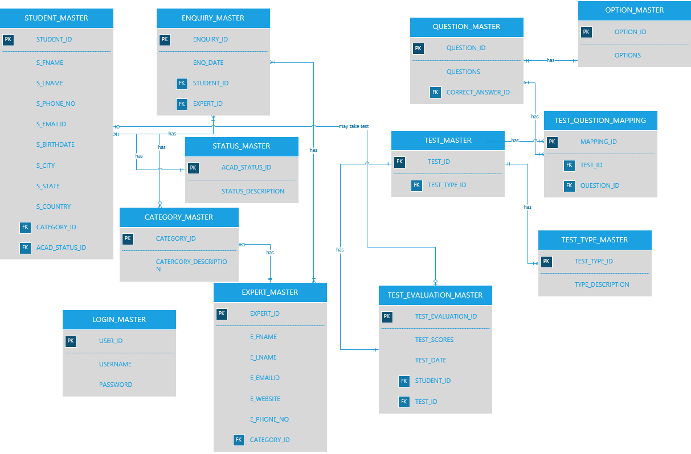

*Prepared by: Ishani Jariwala*

*Version &lt;v.02&gt;*

*Instructor Name:* Nicholas C. Bucciarelli

**  
**

Contents

Contents 2

Revisions 3

1 Project Proposal 4

2 Project Design Report 5

3 Project Implementation Report 11

Revisions

|         |                   |                                                                                                                      |                |
|---------|-------------------|----------------------------------------------------------------------------------------------------------------------|----------------|
| Version | Primary Author(s) | Description of Version                                                                                               | Date Completed |
| v.01    | Ishani Jariwala   | Mapping the correct relationship in the data structure. Created Data structure and inserted meaningful data into it. | 11/18/2015     |
| v.02    | Ishani Jariwala   | Final editing of the report                                                                                          | 11/30/2015     |

Project Proposal 
===============================================================================================================

Business Description
====================

Many a time’s students are in dilemma over which career path to choose
for them. Career Counselling System helps student in choosing the right
career based on their field of education or area of interest. This
system can help students in selecting the optimum career path for them,
by mapping their queries to an appropriate expert from the expert panel.

The assumption for the proposed system is the experts for each fields
for the career counselling are registered with the system.

Problem Statement
=================

Student often are deprived of career counselling. This career
counselling system can help students seek a genuine advice to craft
their career. Currently there are no genuine medium through which
students can seek guidance. There is a need of such authentic system
where the best experts are placed in panel who can craft the student’s
career.

Proposed solution 
==================

When the student sends an enquiry mentioning their confusion and
category (Field). This query will be mapped with expert entity where all
experts will be listed; and the student can schedule their appointment
with experts. Also the students can take assessment test. The result of
the test will decide in which category the student falls into and
accordingly the expert is assigned. The questions for this aptitude test
will be stored in a question\_master and the correct answers to the
question will again map the category and expert for the student.

Users
=====

The Primary user is a Student in need of career counselling. Another
user will be Experts in different fields of study.

Project Design Report
=====================

ENTITY AND ATTRIBUTE TABLE
==========================

| Data Constructs             | Data Types     | Definition and Relationships                                                                                   |
|-----------------------------|----------------|----------------------------------------------------------------------------------------------------------------|
|                             |                |                                                                                                                |
| 1.  STUDENT\_MASTER         |                | Student seeking the career guidance.                                                                           |
| 1.  STUDENT\_ID             | INTEGER        | Primary Key for STUDENT\_MASTER.                                                                               |
| 1.  S\_FNAME                | VARCHAR (40)   | First name of the student.                                                                                     |
| 1.  S\_LNAME                | VARCHAR (40)   | Last name of the student.                                                                                      |
| 1.  S\_PHONE\_NO            | VARCHAR (20)   | Contact number of the student.                                                                                 |
| 1.  S\_EMAILID              | VARCHAR (30)   | Email address of the student.                                                                                  |
| 1.  S\_BIRTHDATE            | DATE           | Birthdate of the student.                                                                                      |
| 1.  S\_CITY                 | VARCHAR (30)   | City of the student.                                                                                           |
| 1.  S\_STATE                | VARCHAR (30)   | State of the student.                                                                                          |
| 1.  S\_COUNTRY              | VARCHAR (30)   | Country of the student.                                                                                        |
| 1.  CATEGORY\_ID            | INTEGER        | Foreign Key of CATEGORY\_MASTER. To map the students field of interest.                                        |
| 1.  ACAD\_STATUS\_ID        | INTEGER        | Foreign Key of STATUS\_MASTER. To know the present academic status of the student.                             |
|                             |                |                                                                                                                |
| 1.  ENQUIRY\_MASTER         |                | To map the enquiries generated by student.                                                                     |
| 1.  ENQUIRY\_ID             | INTEGER        | Primary key for ENQUIRY\_MASTER.                                                                               |
| 1.  ENQUIRY\_DATE           | DATE           | To know when the enquiry was raised.                                                                           |
| 1.  STUDENT\_ID             | INTEGER        | Foreign key of STUDENT\_MASTER. To map the student who made the enquiry.                                       |
| 1.  EXPERT\_ID              | INTEGER        | Foreign key of EXPERT\_MASTER. To know which student is assigned to which expert.                              |
|                             |                |                                                                                                                |
|                             |                |                                                                                                                |
| **Data Constructs**         | **Data Types** | **Definition and Relationships**                                                                               |
|                             |                |                                                                                                                |
| 1.  STATUS\_MASTER          |                | To know the student’s present academic status.                                                                 |
| 1.  ACAD\_STATUS\_ID        | INTEGER        | Primary key for STATUS\_MASTER.                                                                                |
| 1.  S\_STATUS               | VARCHAR(30)    | Could be :                                                                                                     
                                                                                                                                                                
                                                1. Pursuing/completed graduation;                                                                               
                                                                                                                                                                
                                                2. Above class 12;                                                                                              
                                                                                                                                                                
                                                3. Class 11-12;                                                                                                 
                                                                                                                                                                
                                                4. Class 8-10.                                                                                                  |
|                             |                |                                                                                                                |
| 1.  CATEGORY\_MASTER        |                | Student’s different areas of interest.                                                                         |
| 1.  CATEGORY\_ID            | INTEGER        | Primary Key for CATEGORY\_MASTER.                                                                              |
| 1.  CATEGORY\_DESCRIPTION   | VARCHAR(30)    | Different types of categories like :                                                                           
                                                                                                                                                                
                                                1.  Management;                                                                                                 
                                                                                                                                                                
                                                2.  Professional;                                                                                               
                                                                                                                                                                
                                                3.  Finance/Commerce;                                                                                           
                                                                                                                                                                
                                                4.  Science;                                                                                                    
                                                                                                                                                                
                                                5.  Arts;                                                                                                       
                                                                                                                                                                
                                                6.  Engineering;                                                                                                
                                                                                                                                                                
                                                7.  Law;                                                                                                        
                                                                                                                                                                
                                                8.  Medicine;                                                                                                   
                                                                                                                                                                
                                                9.  Actuary;                                                                                                    
                                                                                                                                                                
                                                10. Economics.                                                                                                  |
|                             |                |                                                                                                                |
| 1.  EXPERT\_MASTER          |                | Experts who will give career advices to the students.                                                          |
| 1.  EXPERT\_ID              | INTEGER        | Primary Key for EXPERT\_MASTER.                                                                                |
| 1.  E\_FNAME                | VARCHAR(40)    | First name of expert.                                                                                          |
| 1.  E\_LNAME                | VARCHAR(40)    | Last name of expert.                                                                                           |
| 1.  E\_EMAILID              | VARCHAR(30)    | Email address of expert.                                                                                       |
| 1.  E\_WEBSITE              | VARCHAR(100)   | Website of expert if any.                                                                                      |
| 1.  E\_PHONE\_NO            | VARCHAR(20)    | Contact number of the expert.                                                                                  |
| 1.  CATEGORY\_ID            | INTEGER        | To map which category (field) the expert has expertise on. Foreign key of CATEGORY\_MASTER.                    |
|                             |                |                                                                                                                |
| **Data Constructs **        | **Data Types** | **Definition and Relationships**                                                                               |
|                             |                |                                                                                                                |
| 1.  LOGIN\_MASTER           |                | As each student will have login access to the system; hence this table is used to store the login credentials. |
| 1.  USER\_ID                | INTEGER        | Primary Key of the LOGIN\_MASTER.                                                                              |
| 1.  USERNAME                | VARCHAR(40)    | Student’s email address is the username here.                                                                  |
| 1.  U\_PASSWORD             | VARCHAR(40)    | Student’s password.                                                                                            |
|                             |                |                                                                                                                |
| 1.  TEST\_MASTER            |                | To map tests and its types.                                                                                    |
| 1.  TEST\_ID                | INTEGER        | Primary key for the TEST\_MASTER.                                                                              |
| 1.  TEST\_TYPE\_ID          | INTEGER        | Foreign Key of TEST\_TYPE\_MASTER.                                                                             |
|                             |                |                                                                                                                |
| 1.  QUESTION\_MASTER        |                | To store the test questions.                                                                                   |
| 1.  QUESTION\_ID            | INTEGER        | Primary Key for QUESTION\_MASTER.                                                                              |
| 1.  QUESTIONS               | VARCHAR(255)   | Set of questions for test.                                                                                     |
| 1.  CORRECT\_ANSWER\_ID     | INTEGER        | Foreign Key of the OPTION\_MASTER. Which maps the correct answer to the question.                              |
|                             |                |                                                                                                                |
| 1.  TEST\_TYPE\_MASTER      |                | To describe the types of tests for students.                                                                   |
| 1.  TEST\_TYPE\_ID          | INTEGER        | Primary key for TEST\_TYPE\_MASTER.                                                                            |
| 1.  TYPE\_DESCRIPTION       | VARCHAR(50)    | The type of tests the students can take. It may include :                                                      
                                                                                                                                                                
                                                1.  Aptitude test;                                                                                              
                                                                                                                                                                
                                                2.  Personality test;                                                                                           
                                                                                                                                                                
                                                3.  Interest test.                                                                                              |
|                             |                |                                                                                                                |
|                             |                |                                                                                                                |
|                             |                |                                                                                                                |
|                             |                |                                                                                                                |
|                             |                |                                                                                                                |
|                             |                |                                                                                                                |
| **Data Constructs **        | **Data Types** | **Definition and Relationships**                                                                               |
|                             |                |                                                                                                                |
| 1.  TEST\_EVALUTION\_MASTER |                | To record the test evaluation of the student.                                                                  |
| 1.  TEST\_EVALUATION\_ID    | INTEGER        | Primary Key for TEST\_EVALUATION\_MASTER.                                                                      |
| 1.  TEST\_SCORE             | VARCHAR(50)    | Student’s score that is evaluated.                                                                             |
| 1.  TEST\_DATE              | DATE           | Date on which the test was taken by student.                                                                   |
| 1.  STUDENT\_ID             | INTEGER        | Foreign Key of STUDENT\_MASTER. To know which student took the test.                                           |
| 1.  TEST\_ID                | INTEGER        | Foreign key of TEST\_MASTER. To know which test the student have taken.                                        |
|                             |                |                                                                                                                |
| 1.  TEST\_QUESTION\_MAPPING |                | To map the tests and their respective questions.                                                               |
| 1.  MAPPING\_ID             | INTEGER        | Primary key for TEST\_QUESTION\_MAPPING.                                                                       |
| 1.  TEST\_ID                | INTEGER        | Foreign key of TEST\_MASTER. To know which test the student have taken.                                        |
| 1.  QUESTION\_ID            | INTEGER        | Foreign key of QUESTION\_MASTER. To know which questions to be given to the student who have taken the test.   |
|                             |                |                                                                                                                |
| 1.  OPTION\_MASTER          |                | To give options to the questions in tests.                                                                     |
| 1.  OPTION\_ID              | INTEGER        | Primary Key for the OPTION\_MASTER.                                                                            |
| 1.  OPTIONS                 | VARCHAR(50)    | Set of options to be given for each questions in test.                                                         |

This table above describes the data constructs, relationships, data
types and definition of the entire Career Counselling System.

RELATIONAL DATA MODEL
=====================

As seen in ERD, the Database is fully normalised keeping in mind the
mapping cardinalities. In order to remove one-to-many relationships, a
third mapping table has been made. For example – In order to know which
students are under one expert, we have ENQUIRY\_MASTER that explains
one-to-many relationship as one expert can have many students seeking
advice from him/her. Similarly one-to-one and many-to-many relationships
are handled as seen in the ERD model above.

BUSINESS RULES 
===============

1.  Student must raise an enquiry to the system with their query.

2.  Each student will be having a separate login to access the system.

3.  Student can directly seek a counselling from Experts in their field
    of interest.

4.  Students also have a counselling through a career assessment test.
    The system presents a set of questionnaire and collects the answers
    from the student. The system generates a career that fits best as
    per the students skill set.

5.  Each student can take counselling with only one expert at a time.

6.  Each student must provide their personal and academic information.

**  
**

Project Implementation Report
=============================

This project focuses on designing a database for Students who can seek
Career advices from their interested fields (career categories) Experts.
Many a time’s students are in dilemma over which career path to choose
for them. Career Counselling System helps student in choosing the right
career based on their field of education or area of interest. This
system can help students in selecting the optimum career path for them,
by mapping their queries to an appropriate expert from the expert panel.

Student often are deprived of career counselling. This career
counselling system can help students seek a genuine advice to craft
their career. Currently there are no genuine medium through which
students can seek guidance. There is a need of such authentic system
where the best experts are placed in panel who can craft the student’s
career.

When the student sends an enquiry mentioning their career confusion and
category (Field). This query will be mapped with expert entity where all
experts will be listed; and the student can schedule their appointment
with experts. Also the students can take assessment test. The result of
the test will decide in which category the student falls into and
accordingly the expert is assigned. The questions for this aptitude test
will be stored in a question\_master and the correct answers to the
question will again map the category and expert for the student.

This project has been implemented on a relational database management
system hosted on a Windows server. SQL Server 2014 has been used as the
RDBMS and is deployed on the Windows Server 2012 64bit server. The RDBMS
was accessed using SQL Server Management Studio and Visio 2013 is used
to design the ER model.

The process of the database application can be described as –

IBM Blade Server on the local Windows 2012 R2 64-bit machine will be
connected to the Internet. Through this any student from any corner of
the world can access Career Counselling System.

The Database server Microsoft SQL Server 2012, mounted on the local
machine has the entire data structure of Career Counselling System. This
enables the Student login into the system and create their account.
Through the account they can directly seek the career advices from
Experts. Also the students can take assessment test and then depending
on the result can seek advice from the experts.

This Database Server is accessed by Relational Database Server which
displays the information on the front-end to the user. Here as the
system will be working through a website than the way the Student
interacts with the system, the resulting information will be displayed
on the screen of the website. The website can be made through any
programming language. The Job of the relational database server is to
fetch information from the database and display it to the front-end
system.

Database Structure 
===================

**Creation of tables and inserting values into it:**

The database has been created in MS SQL Server 2012 with the name
“***idjariwa6595***”.

This database consists of the tables of the class labs (They are named
with lower cases) and my project (Named with UPPERCASE). Project
database tables are:

\[dbo\].\[CATEGORY\_MASTER\], \[dbo\].\[ENQUIRY\_MASTER\],
\[dbo\].\[EXPERT\_MASTER\], \[dbo\].\[LOGIN\_MASTER\],
\[dbo\].\[OPTION\_MASTER\], \[dbo\].\[QUESTION\_MASTER\],
\[dbo\].\[STATUS\_MASTER\], \[dbo\].\[STUDENT\_MASTER\],
\[dbo\].\[TEST\_MASTER\], \[dbo\].\[TEST\_EVALUATION\_MASTER\],
\[dbo\].\[TEST\_QUESTION\_MAPPING\] and \[dbo\].\[TEST\_TYPE\_MASTER\]

The data structure is normalised and is designed to serve a helping hand
to the students who needs career counselling.

**Inserting Data into the tables created:**

The database has been created in MS SQL Server 2012 with the name
“***idjariwa6595***”. All the tables have relevant data entry in the
system.

**SQL File:**
